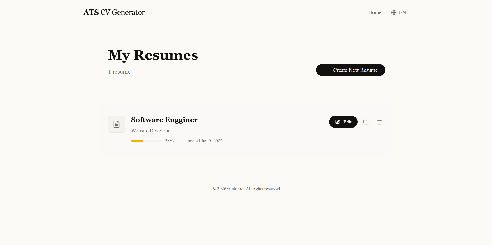

# ATS CV Generator

Aplikasi ini dibuat khusus untuk memudahkan job seekers kayak kita yang lagi cari kerja. Jangan mau CV bagus tapi teok-teok di filter sistem ATS kan? Nah ini solusinya.

## Konsep

Ide awalnya sederhana: **buat CV yang bukan cuma bagus buat manusia, tapi juga "dimengerti" sama sistem ATS (Applicant Tracking System)**. Karena setara banyak CV bagus yang langsung di-skip cuma gara-gara format atau keywords yang kurang tepat.

## Fitur

- **AI-Powered Generator** – Buat summary dan experience descriptions yang optimized
- **ATS Score Calculator** – Tau langsung seberapa "ATS-friendly" CV kamu
- **Skills Suggestion** – Rekomendasi skills berdasarkan job description
- **Export to PDF/DOCX** – Download dalam format yang HR-friendly
- **Dark Mode** – Nyaman buat mata yang lagi lelah coding

## Tech Stack

- **Next.js** – React framework yang cepat
- **TypeScript** – Supaya nggak ketemu undefined di production
- **Tailwind CSS** – Styling yang ringkas dan powerful
- **Claude AI** – Brains di balik generate dan improve features
- **Prisma** – Database management yang smooth

## Setup

### Development Mode (Cepet)

Buat kerja lokal doang:

```bash
npm install
cp .env.example .env.local
# Isi API key lu di .env.local
npm run dev
```

Buka [http://localhost:3000](http://localhost:3000) di browser, udah jalan.

### Production (Buat Deploy)

Mau setup buat production atau deploy? Gini:

```bash
git clone <repository-url>
cd ats-cv-generator

npm install
cp .env.example .env.local
# Isi API key, database URL, sama config lainnya

npm run build
npm start
```

**Yang diperluin:**
- Node.js 18+
- API key dari Anthropic atau OpenAI
- (Opsional) Database kalau lu mau simpan data

**Kalau error:**
- API key nggak ketemu? Cek `.env.local` lu
- Port 3000 udah pakai? Coba `PORT=3001 npm run dev`
- Memory penuh? `NODE_OPTIONS=--max-old-space-size=4096 npm run dev`

## Gimana Cara Kerjanya?

1. **Input CV** – Masukan data personal, experience, pendidikan, skills
2. **Optimize** – Gunakan AI untuk improve summary atau generate experience descriptions
3. **Check ATS Score** – Lihat berapa score ATS dari CV kamu
4. **Export** – Download CV dalam format PDF atau DOCX

## Catatan

- Input bagus = output bagus. Jangan malas ngisi detail CV
- ATS score cuma tools aja, bukan akhir segalanya
- Jangan lupa dicek ulang sebelom kirim

## Credits & License

### Library & Tools yang Kami Pake

Project ini nggak jadi tanpa:

- **Next.js** – framework buat React
- **Tailwind CSS** – CSS yang praktis
- **Shadcn/ui** – component siap pakai
- **Prisma** – database ORM
- **Claude AI (Anthropic)** – AI yang handle generate text
- **React PDF** – buat export PDF

### License

Pakai lisensi **MIT**. Boleh dipakai, dimodif, dibagiin, asal jangan lupa cantum lisensi originalnya. Gak ada garansi dari kita.

Detail lengkapnya ada di [LICENSE](./LICENSE).

### Mau Kontribusi?

Ayok sumbang! Caranya:

1. Fork repo ini
2. Buat branch baru (`git checkout -b feature/IdeaKeren`)
3. Commit (`git commit -m 'Tambah fitur keren'`)
4. Push (`git push origin feature/IdeaKeren`)
5. Bikin Pull Request

---

**Semangat hidup! Semoga dapet kerja impian** 🚀
